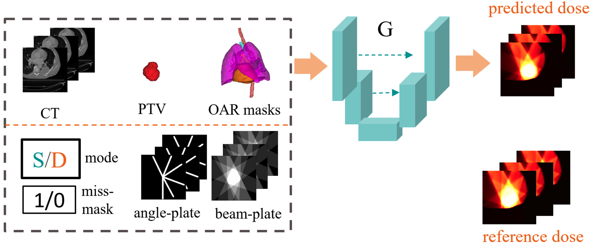
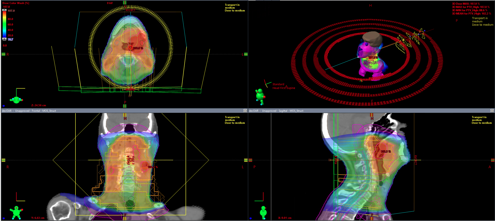

# GDP-HMM_AAPMChallenge

The GDP-HMM repository provides code and tutorial are intended to help get participants started with developing dose prediction models for the GDP-HMM Challenge in AAPM 2025. 

# Content 

- [Install](#install)
- [What this repo does](#what-this-code-does)
- [What this repo does not](#what-this-code-does-not)
- [Simplified Background](#Simplified-Background)
- [Data Understanding and Visualization](#Data-Understanding-and-Visualization)
- [Data Preprocess](#Data-Preprocess)
- [Simple baseline](#Simple-baseline)
- [Evaluation Methods](#Evaluation-Methods)
- [Challenge results (to do)](#Challenge-results)
- [Challenge organizers](#Challenge-organizers)


## Install

```bash
$ pip install vit-pytorch
```


## What this repo does

- *Simplified RT Background Tutorial*. We provide a link to article about the background of this challenge. This will help participants with limited RT background to quickly get started. 

- *Data Understanding and Visualization*. We provide jupyter notebook to load and visualize the data step by step, together with explanation. Please also check the article for more information. 

- *Data Preprocess*. We provide code of data preprocess inspired by [2], including the creation of angle plate and beam plate. 

- *Simple baseline*. We provide a simple baseline with the backbone of <a href="https://github.com/MIC-DKFZ/MedNeXt" _target='blank'>MedNeXt</a>. The ways of integrated condition to the network are motivated from [2]. We include data loader, network, loss function, running command line, etc., to help participants get started. 

- *Evaluation Methods*. We provide the code or/and details of evaluation metrics. 

For any questions related to above, welcome to open issues or email the lead organizer Riqiang Gao. 


## What this repo does NOT

To keep this repo tied to the challenge and to be fair to all participants, we do not encourage open issues related to below topics. Of course, if you find one topic is really important, welcome to send an email to the lead organizer. We may update our READE.md files and send notifications to participants. The **not-eoncouraged issues of this repo** include 

- *Urgent Request*. We may not be able to monitor the issues of this repo very actively. If you need a urgent response, e.g., if you find the data are broken or cannot access the data, please directly send an email to the lead organizer so we can solve the problem for all participants ASAP.  

- *AI engineering tricks*. We may not be able to offer suggestions on engineering tricks in this repo. 

- *AI Technique Questions of Related Papers*. We may not be able to address AI technique questions of related papers in this repo. However, if it is only about clinical background and related to this challenge, we are happy to take it in either issue or email. 

- *Job Positions in Siemens Healthineers*. We always welcome talent people to join us. However, please send an email rather than open an issue in this repo for questions in this category. 

## Simplified Background to the Challenge

Radiation therapy (RT) is an essential cancer treatment and is applicable to about 50% of cancer patients. The 3D dose prediction has been important for assisting the RT planning. Ref [1] could provide decent introduction to the participates without RT background. In addtion, [the summary paper](https://aapm.onlinelibrary.wiley.com/doi/full/10.1002/mp.14845) of a previous related challenge OpenKBP could be helpful (helpful to the RT background, but note contexts in this challenge is quite different from OpenBKP). 

It could be helpful to gain more knowledge about RT, however, participants still can do a great job without deep RT background, since we define the input/output clearly in the task of this challenge. However, if you have limited knowledge about AI and deep learning, you may need to learn fast to achieve the awards :blush:. To be successful in this challenge, participates need to 

The input of this task includes CT, PTVs/OARs mask, beam geometries and so on. The output is a 3D dose distribution generated from Eclipse (treatment planning system from Varian) following the method described in [1]. 



## Data-Understanding-and-Visualization

One example of Eclipse Visulization is shown below. For jupyter visualization with npz, please visit data_visualization.ipynb. 




## Challenge organizers 

- Riqiang Gao, Ph.D., lead organizer, (Siemens Healthineers)
- Florin Ghesu, Ph.D., (Siemens Healthineers)
- Wilko Verbakel, Ph.D., (Varian, a Simens Healthineers company)
- Rafe Mcbeth, Ph.D., (University of Pennsylvania)
- Sandra Meyers, Ph.D., (UC San Diego Health)
- Masoud Zarepisheh, Ph.D., (Memorial Sloan Kettering Cancer Center)
- Ali Kamen, Ph.D., (Siemens Healthineers)

Please contact Riqiang Gao with riqiang.gao@siemens-healthineers.com for further questions. 

# Citation 

- Data citation. Please cite the below technique paper [1] building the dataset (or the challenge summary paper when it is available) if you find the data and challenge is helpful to your research. 

- Baseline citation. If you find the method and code of data preprocess in the repo (e.g., creating the angle and beam plates) is inspiring to your work, please cite [2]. If you use or adjust the MedNeXt as your network structure, please cite [3]. 

```
[1] Riqiang Gao, Mamadou Diallo, Wilko Verbakel, Sandra Meyers, Masoud Zarepisheh, Rafe Mcbeth, Florin Ghesu, Ali Kamen. Automating High Quality RT Planning at Scale. Technique Note 2025.

[2] Riqiang Gao, Bin Lou, Zhoubing Xu, Dorin Comaniciu, and Ali Kamen. "Flexible-cm gan: Towards precise 3d dose prediction in radiotherapy." In Proceedings of the IEEE/CVF Conference on Computer Vision and Pattern Recognition, 2023.

[3] Saikat Ray, Gregor Koehler, Constantin Ulrich, Michael Baumgartner, Jens Petersen, Fabian Isensee, Paul F. Jaeger, and Klaus H. Maier-Hein. "Mednext: transformer-driven scaling of convnets for medical image segmentation." In International Conference on Medical Image Computing and Computer-Assisted Intervention, 2023.
```

