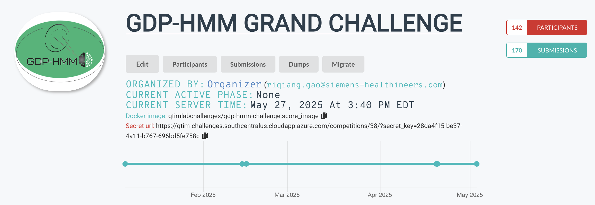

# Competition Results 

The OpenKBP attracted 141 teams before the deadline of the challenge. There are around 220 total submissions have been made (the number shown in the platform is 170, as about 50 early submissions in Phase I and II were deleted because of platform maintenance and storage issue.)

The competition started at 01/09/2025 and ended at 05/02/2025. There are 17 teams engaged in the final testing phase (19 teams displayed in the platform, one is from the platform team and one is from organizer). We will re-open the validation phase or/and release the reference plans (validation) for post-challenge evaluations. 

The top 6 teams will be awarded with money after they open source their solutions: 

**1st**: $1300 for Team Yasin, solution repo: 

**2nd**: $1100 for Team tyxiong123

**3rd**: $400 for Team rcgao

**4th**: $400 for Team PVmed

**5th**: $400 for Team SKLSDE-BH

**6th**: $400 for Team MedVision

**Top 10** teams (two teams ranked 10th as their metrics are very close) will be invited to co-author on the coming summary paper. Additionally, **top two** teams will be invited to give a talk at AAPM conference. 

# Results Table 

Here's the table sorted by **Final Rank** (ascending order):

| Team | Solution ID | MAE (Metric 1) | MAE Rank | Quality Score (Metric 2) | Quality Rank | Final Rank |
|------|-------------|---------------|----------|--------------------------|--------------|------------|
| Yasin | ID2695 | 2.071 | 1 | 127.50 | 6 | 2.00 |
| tyxiong123 | ID2696 | 2.196 | 4 | 127.69 | 2 | 3.60 |
| rcgao | ID2682 | 2.075 | 2 | 127.12 | 11 | 3.80 |
| PVmed | ID2670 | 2.169 | 3 | 127.28 | 8 | 4.00 |
| SKLSDE-BH | ID2672 | 2.256 | 6 | 127.62 | 3 | 5.40 |
| MedVision | ID2673 | 2.208 | 5 | 127.21 | 10 | 6.00 |
| mavericks | ID2675 | 2.266 | 7 | 127.30 | 7 | 7.00 |
| CWRU-UH-Cornell | ID2684 | 2.397 | 8 | 127.61 | 4 | 7.20 |
| Jsbryaniv | ID2686 | 2.894 | 10 | 127.90 | 1 | 8.20 |
| UCSF-RTPred | ID2681 | 2.623 | 9 | 127.22 | 9 | 9.00 |
| ThibaultHeintz | ID2685 | 2.905 | 11 | 127.58 | 5 | 9.80 |
| rachel | ID2678 | N/A | N/A | N/A | N/A | N/A |
| sunyu0410 | ID2688 | N/A | N/A | N/A | N/A | N/A |
| akamath | ID2690 | N/A | N/A | N/A | N/A | N/A |
| peppa | ID2692 | N/A | N/A | N/A | N/A | N/A |
| wangshangan | ID2647 | N/A | N/A | N/A | N/A | N/A |
| Organizer | ID2694 | N/A | N/A | N/A | N/A | N/A |
| Organizer | ID2647 | N/A | N/A | N/A | N/A | N/A |
| SiemensHealthineers(organizer) | ID2676 | N/A | N/A | N/A | N/A | N/A |

The performance of other teams are not shown. They either achieved a MAE larger than 3.4 or not a valid solution. 

**A few notes**: 
- The MAE is computed on whole test set with 498 plans, the quality score is computed on a random subsite with 50 plans (due to time and resource constraints). 
- The difference between the quality score of the top 10 solutions are small, but all better than the RapidPlan used in [1] (117.85). 
- Final Rank = (MAE_rank * 4 + Quality_rank) / 5.

